# Week 5 — MySQL 資料庫

## 檔案結構

```
week5/
├── README.md              # 本文件（SQL 指令 + 截圖）
├── data.sql               # mysqldump 匯出的完整資料庫
├── sql/
│   ├── task2_schema.sql
│   ├── task3_crud.sql
│   ├── task4_aggregation.sql
│   └── task5_join.sql
└── screenshots/
```

## 執行方式

```bash
cd week5
mysql -u root -p < sql/task2_schema.sql
mysql -u root -p < sql/task3_crud.sql
mysql -u root -p < sql/task4_aggregation.sql
mysql -u root -p < sql/task5_join.sql
mysqldump -u root -p --set-gtid-purged=OFF website > data.sql
```

---

## Task 1：安裝 MySQL Server

安裝 [MySQL Community Server 8.x](https://dev.mysql.com/downloads/mysql/)，連線測試：

```bash
mysql -u root -p
```

---

## Task 2：建立 Database 與 Table

```sql
CREATE DATABASE IF NOT EXISTS website;
USE website;

CREATE TABLE IF NOT EXISTS member (
  id INT UNSIGNED NOT NULL AUTO_INCREMENT,
  name VARCHAR(255) NOT NULL,
  email VARCHAR(255) NOT NULL,
  password VARCHAR(255) NOT NULL,
  follower_count INT UNSIGNED NOT NULL DEFAULT 0,
  time DATETIME NOT NULL DEFAULT CURRENT_TIMESTAMP,
  PRIMARY KEY (id)
);
```

驗證：

```sql
USE website;
SHOW TABLES;
DESC member;
```

### 執行結果

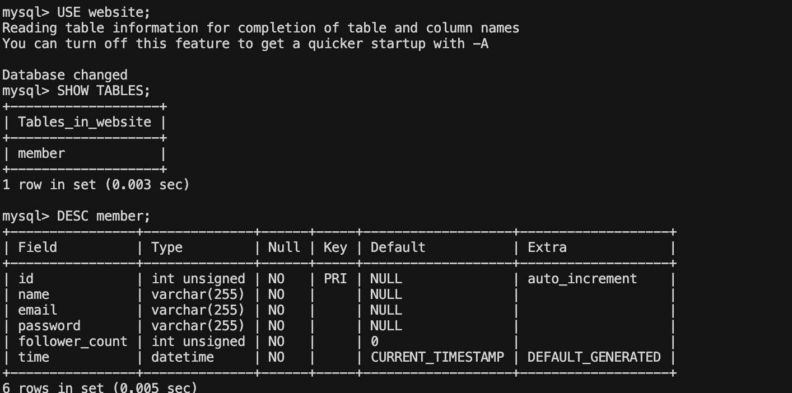

---

## Task 3：SQL CRUD

### 1 & 2. 新增資料，並取得所有資料

```sql
USE website;

INSERT INTO member (name, email, password)
VALUES ('test', 'test@test.com', 'test');

INSERT INTO member (name, email, password, follower_count) VALUES
('Alice', 'alice@example.com', 'pass1', 10),
('James', 'james@example.com', 'pass2', 25),
('Esther', 'esther@example.com', 'pass3', 5),
('Bob', 'bob@example.com', 'pass4', 0);

SELECT * FROM member;
```

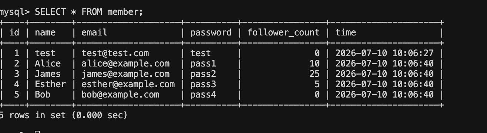

### 3. 依 time 降冪排序

```sql
SELECT * FROM member ORDER BY time DESC;
```

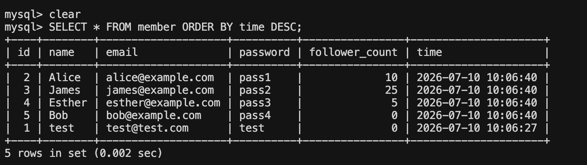

### 4. 取第 2~4 筆（LIMIT / OFFSET）

```sql
SELECT * FROM member ORDER BY time DESC LIMIT 3 OFFSET 1;
```

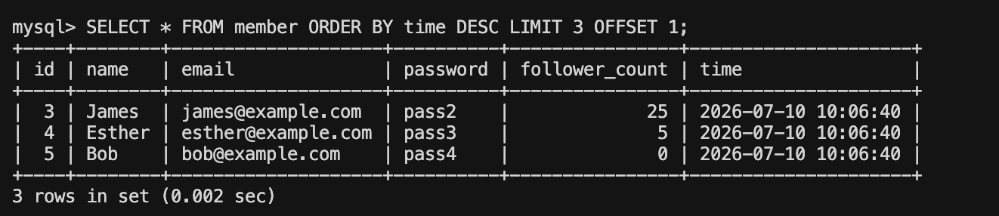

### 5. email 精確比對

```sql
SELECT * FROM member WHERE email = 'test@test.com';
```

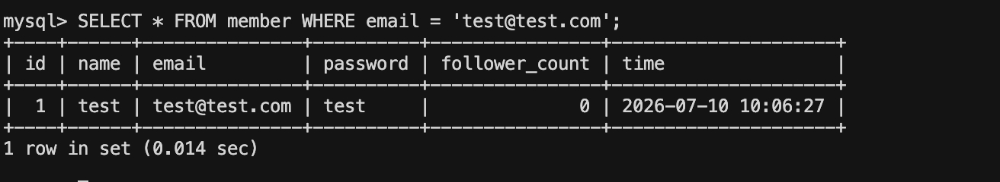

### 6. name 模糊比對（包含 es）

```sql
SELECT * FROM member WHERE name LIKE '%es%';
```

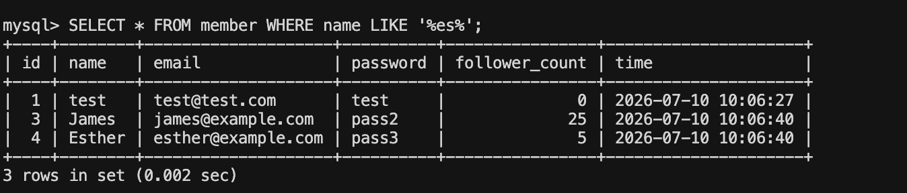

### 7. 多條件查詢（email + password）

```sql
SELECT * FROM member
WHERE email = 'test@test.com' AND password = 'test';
```

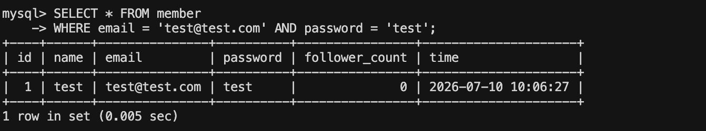

### 8. 更新 name 為 test2

```sql
UPDATE member
SET name = 'test2'
WHERE email = 'test@test.com';

SELECT * FROM member WHERE email = 'test@test.com';
```

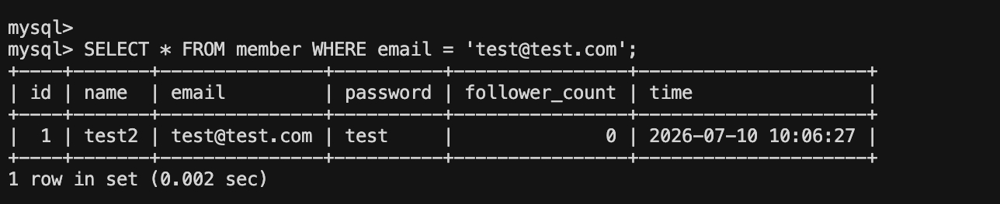

---

## Task 4：SQL Aggregation

```sql
USE website;

-- 1. 筆數
SELECT COUNT(*) FROM member;

-- 2. follower_count 總和
SELECT SUM(follower_count) FROM member;

-- 3. follower_count 平均
SELECT AVG(follower_count) FROM member;

-- 4. 前 2 筆 follower_count 的平均
SELECT AVG(follower_count) AS avg_top_2_follower_count
FROM (
  SELECT follower_count
  FROM member
  ORDER BY follower_count DESC
  LIMIT 2
) AS top_two;
```

### 執行結果

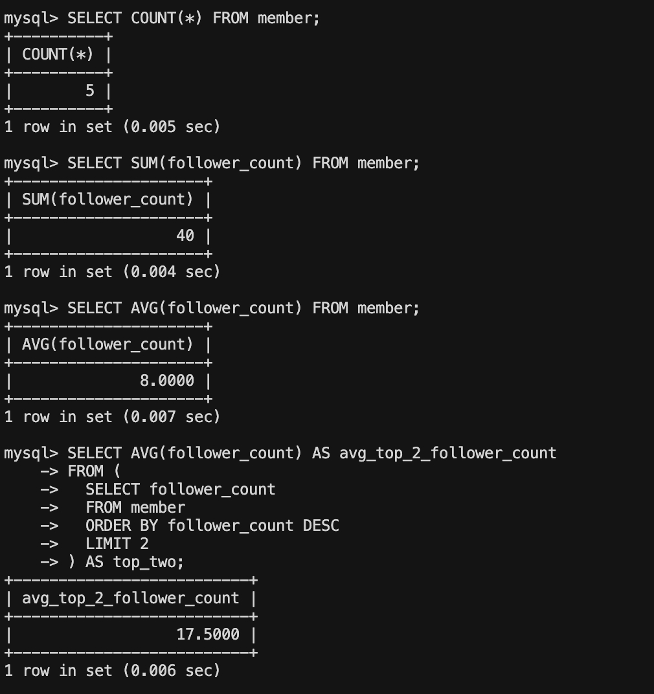

---

## Task 5：SQL JOIN

### 建立 message 表並插入資料

```sql
USE website;

CREATE TABLE IF NOT EXISTS message (
  id INT UNSIGNED NOT NULL AUTO_INCREMENT,
  member_id INT UNSIGNED NOT NULL,
  content TEXT NOT NULL,
  like_count INT UNSIGNED NOT NULL DEFAULT 0,
  time DATETIME NOT NULL DEFAULT CURRENT_TIMESTAMP,
  PRIMARY KEY (id),
  FOREIGN KEY (member_id) REFERENCES member(id)
);

INSERT INTO message (member_id, content, like_count)
SELECT id, 'Hello from test user', 3
FROM member
WHERE email = 'test@test.com'
LIMIT 1;

INSERT INTO message (member_id, content, like_count)
SELECT id, 'Another message', 7
FROM member
WHERE email = 'alice@example.com'
LIMIT 1;

INSERT INTO message (member_id, content, like_count) VALUES
(1, '你好世界', 3),
(2, 'Alice 的隨意留言', 7),
(3, 'James 推薦這首歌', 15),
(4, 'Esther：今天吃什麼', 2);
```

### 1. 所有留言 + 發送者 name

```sql
SELECT
  message.id,
  message.content,
  message.like_count,
  message.time,
  member.name AS sender_name
FROM message
JOIN member ON message.member_id = member.id;
```

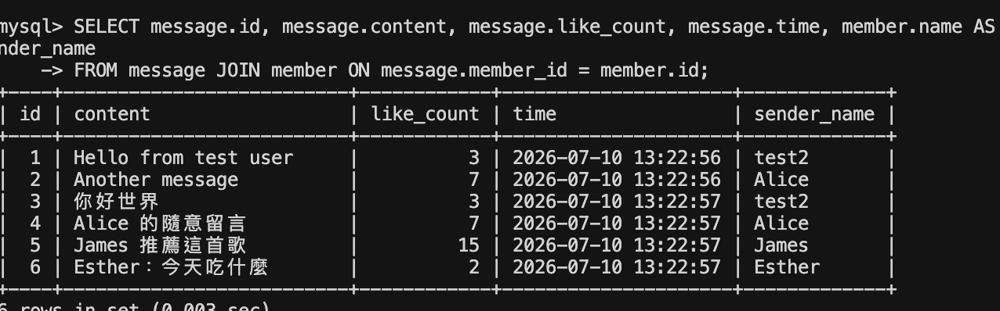

### 2. test@test.com 的所有留言

```sql
SELECT
  message.id,
  message.content,
  message.like_count,
  message.time,
  member.name AS sender_name
FROM message
JOIN member ON message.member_id = member.id
WHERE member.email = 'test@test.com';
```

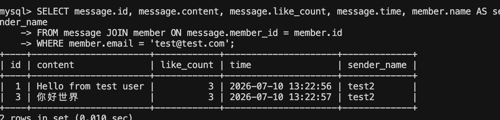

### 3. test@test.com 留言的平均 like_count

```sql
SELECT AVG(message.like_count) AS avg_like_count
FROM message
JOIN member ON message.member_id = member.id
WHERE member.email = 'test@test.com';
```

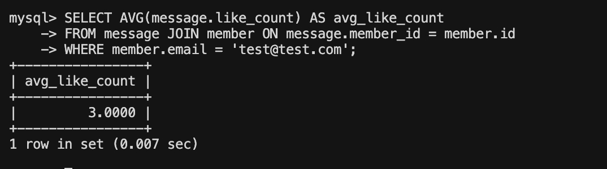

### 4. 依 email 分組計算平均 like_count

```sql
SELECT
  member.email,
  AVG(message.like_count) AS avg_like_count
FROM message
JOIN member ON message.member_id = member.id
GROUP BY member.email;
```

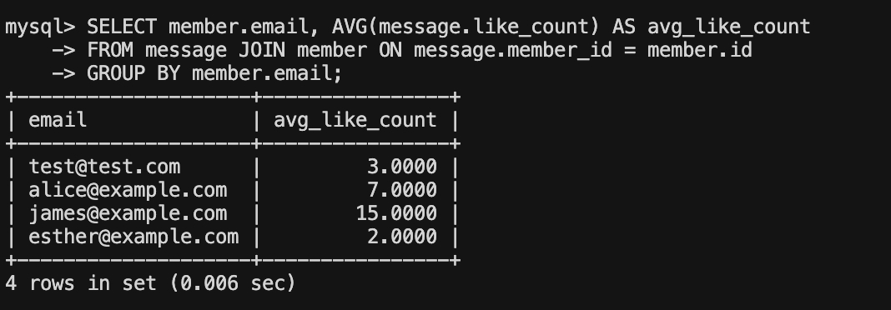

---

## 匯出 data.sql

```bash
mysqldump -u root -p --set-gtid-purged=OFF website > data.sql
```

完整資料庫備份見 [`data.sql`](./data.sql)。
