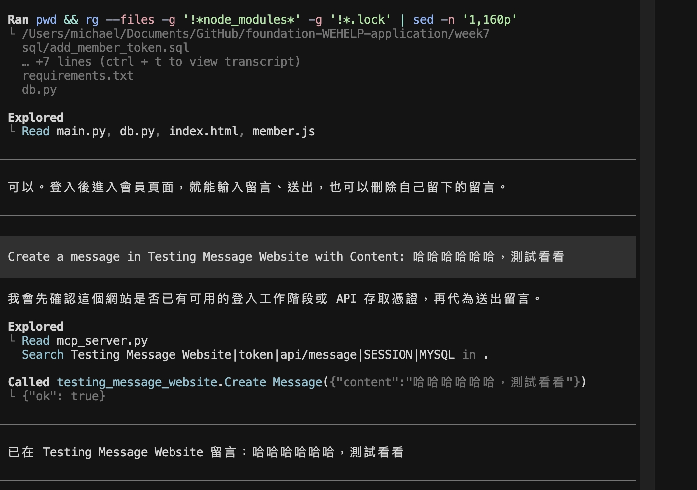
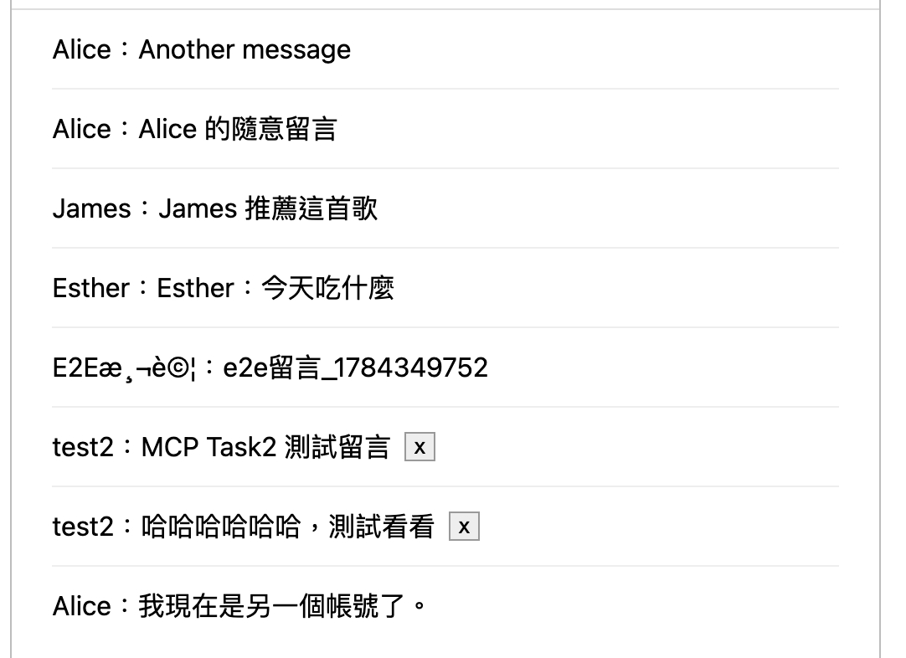
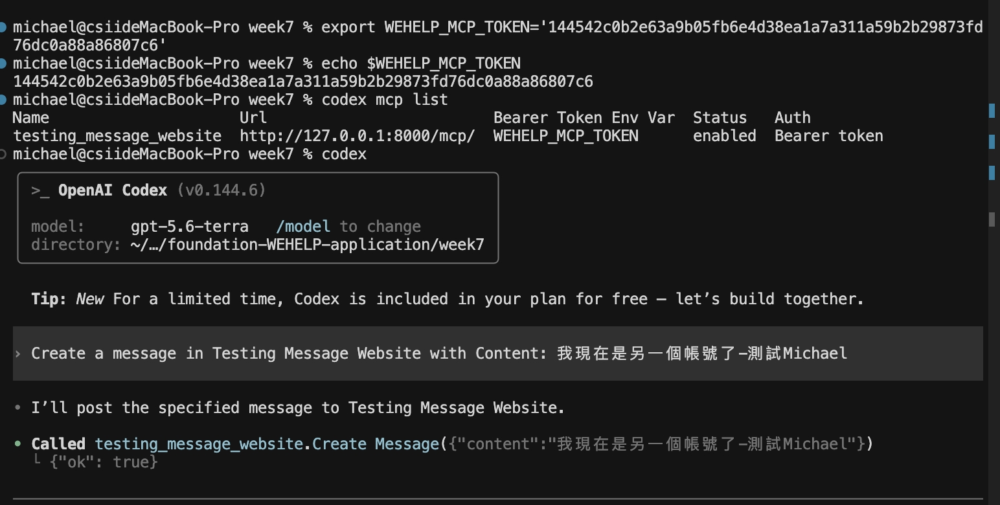
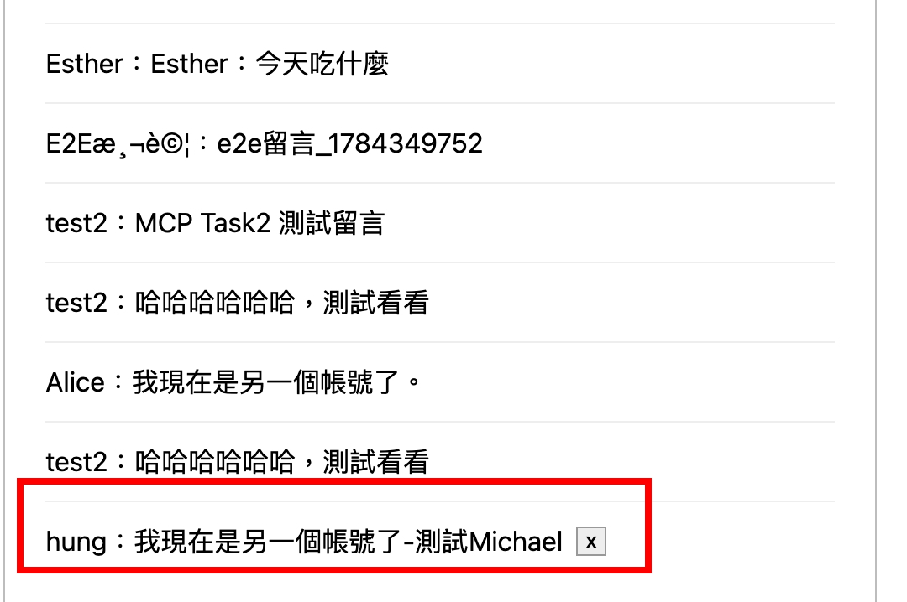

# Week 7 — 整合 MCP Server 與 Web Server

在 Week 6 會員／留言系統上接 FastMCP，讓 AI Agent 用 Bearer Token 代為留言。

## 檔案結構

```
week7/
├── README.md
├── requirements.txt
├── .env                 # 本地設定（不上傳）
├── .codex/
│   └── config.toml      # Codex MCP 設定（可複製到 ~/.codex/）
├── main.py              # FastAPI 路由 + mount /mcp
├── mcp_server.py        # FastMCP：Create Message tool
├── db.py                # MySQL 連線、留言、Token
├── sql/
│   └── add_member_token.sql
├── templates/
│   ├── index.html
│   ├── member.html
│   └── ohoh.html
├── static/
│   ├── styles.css
│   └── member.js
└── screenshots/
```

## 執行方式

```bash
cd week7
python3 -m venv venv
source venv/bin/activate   # 或沿用 week6：source ../week6/venv/bin/activate
pip install -r requirements.txt
```

建立 `.env`：

```env
MYSQL_HOST=127.0.0.1
MYSQL_PORT=3306
MYSQL_USER=root
MYSQL_PASSWORD=root
MYSQL_DATABASE=website
SESSION_SECRET=change-me-week7
```

為 `member` 加上 token 欄位（若尚未加過）：

```bash
mysql -u root -p website < sql/add_member_token.sql
```

啟動：

```bash
python main.py
# http://127.0.0.1:8000/
# MCP: http://127.0.0.1:8000/mcp/
```

---

## Task 1：Generate Access Token

會員系統新增 Access Token：登入後可產生金鑰，綁定目前會員並存進 DB。

### 1. Schema

```sql
USE website;

ALTER TABLE member
  ADD COLUMN token VARCHAR(64) NULL UNIQUE;
```

完整腳本見 [`sql/add_member_token.sql`](./sql/add_member_token.sql)。

### 2. Create Token API

| | |
|---|---|
| Endpoint | `PUT /api/token` |
| 成功 | `{ "ok": true, "token": "..." }` |
| 失敗（未登入等） | `{ "error": true }` |

Token 以 `hashlib.sha256` + 隨機 bytes 產生，寫入目前登入會員：

```python
token = hashlib.sha256(secrets.token_bytes(32)).hexdigest()
update_member_token(member_id, token)
```

### 3. 會員頁 UI

- URL：`GET /member`
- 區塊「MCP 伺服器設定」：說明使用 `http://127.0.0.1:8000/mcp/`
- 按鈕「產生 Token」→ `fetch("/api/token", { method: "PUT" })` → 畫面顯示金鑰

---

## Task 2：Build MCP Server and Tool

用 FastMCP 掛進 FastAPI，提供 HTTP MCP 與留言 tool。

### MCP Server

| | |
|---|---|
| Endpoint | `http://127.0.0.1:8000/mcp/` |
| Name | `Testing Message Website` |
| Auth | `Authorization: Bearer [TOKEN]` |

`main.py` 掛載：

```python
from mcp_server import mcp_app

app = FastAPI(lifespan=mcp_app.lifespan)
app.mount("/mcp", mcp_app)
```

### MCP Tool：`Create Message`

| | |
|---|---|
| Description | `Create a new message in Testing Message Website.` |
| Parameter | `content: str` |
| 成功 | `{ "ok": true }` |
| 失敗 | `{ "error": true }` |

流程：

1. 從 `Authorization` 取出 Bearer token
2. `get_member_id_by_token(token)` 查 `member_id`
3. 無效 → `{ "error": true }`
4. 有效 → `create_message(member_id, content)` → `{ "ok": true }`

核心見 [`mcp_server.py`](./mcp_server.py)。

---

## Task 3：Setup and Test HTTP MCP Server in AI Agent

用 Codex 連本機 HTTP MCP，帶 Bearer Token 測試留言。

### 1. 安裝並登入 Codex

```bash
npm install -g @openai/codex
codex login
```

### 2. 設定 MCP

`~/.codex/config.toml`（或專案 [`/.codex/config.toml`](./.codex/config.toml)）：

```toml
[mcp_servers.testing_message_website]
url = "http://127.0.0.1:8000/mcp/"
bearer_token_env_var = "WEHELP_MCP_TOKEN"
```

> `bearer_token_env_var` 填的是**環境變數名稱**，不是 token 字串。

也可：

```bash
codex mcp add testing_message_website \
  --url "http://127.0.0.1:8000/mcp/" \
  --bearer-token-env-var WEHELP_MCP_TOKEN
```

### 3. 匯出 Token 並啟動

1. `python main.py` 跑著
2. 瀏覽器登入 `/member` →「產生 Token」→ 複製金鑰
3. 終端機：

```bash
export WEHELP_MCP_TOKEN='你在會員頁產生的 token'
codex mcp list
codex
```

### 4. 測試 Prompt

```
Create a message in Testing Message Website with Content: {msg}
```

重整 `/member`，留言列表應出現該內容。

### 5. 換帳號驗證

1. 登出 → 另一 email 登入 → 再產生 Token
2. `export WEHELP_MCP_TOKEN='新 token'` 後**重開** Codex
3. 再發不同內容，確認留言掛在正確會員姓名下

### 執行結果

帳號 A — Codex 呼叫 `Create Message`：



帳號 A — 會員頁留言列表：



帳號 B — 換 Token 後再呼叫 `Create Message`：



換帳號後會員頁（不同姓名的 MCP 留言）：


